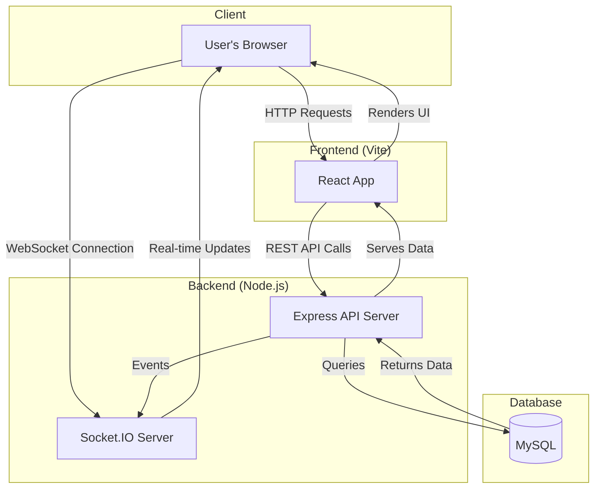

# BGSC Sports League Platform

## Project Aim
This project is a full-stack web application designed to manage sports leagues for the BITS Goa Sports Club (BGSC). It provides a platform for organizing events, tracking matches, and facilitating real-time communication among participants.

## Technical Implementation
The system follows a modern client-server architecture. The frontend is a responsive web interface built with React, managed by the Vite build tool, and styled with Tailwind CSS for a utility-first design. The backend is a robust RESTful API powered by Node.js and the Express.js framework. It uses a MySQL database for data persistence and integrates Socket.IO to enable real-time features like live score updates or notifications.

## Key Features
- **Full-Stack Architecture:** Decoupled frontend (React) and backend (Node.js/Express) for clear separation of concerns.
- **Real-Time Functionality:** Implements WebSockets using Socket.IO for interactive, real-time user experiences.
- **Database Integration:** Utilizes a MySQL database for structured storage of league data, teams, and scores.

## Setup Instructions
See the `README.md` files within the `frontend` and `backend` directories for specific setup and execution instructions.

## System Diagram

